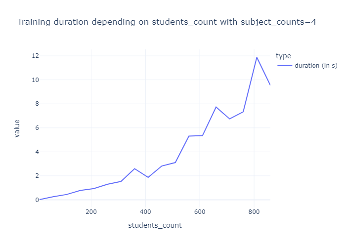
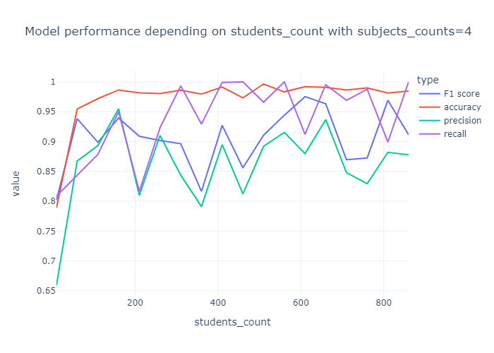
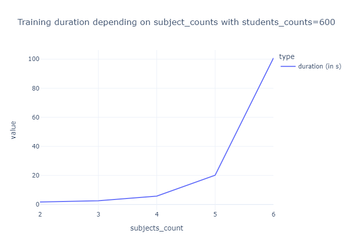
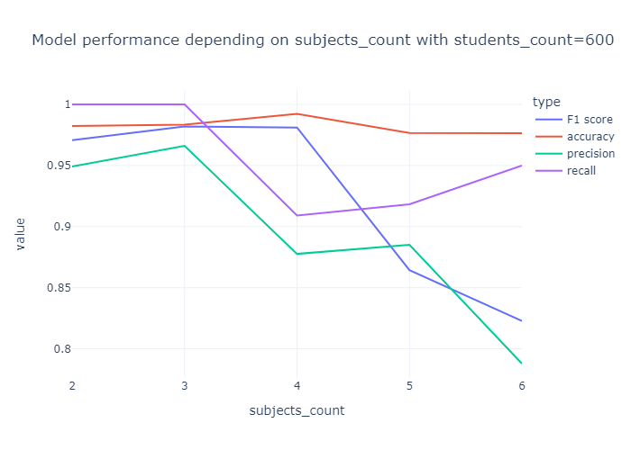

# Projet : student admission

**Groupe :** 

- FORESTIER Alexandre
- SENEJKO Morgane

# Sujet :

L'objectif du projet est de comparer deux solveurs d'optimisation sur le thème d'admissions d'étudiants.

Les jeux de données générés sont constitués de notes d'étudiants sur différentes matières. Selon ces notes, et à l'aide des coefficients pour chaque matière ainsi qu'un seuil d'admissibilité, les étudiants appartiennent à une certaine classe (par exemple: Admis ou Refusé dans le cas ce 2 classes).

La première partie du projet est l'implémentation du Inv-MR-Sort à l'aide d'un solveur d'optimisation (Gurobi).
La deuxième partie est l'implémentation du Inv-NCS à l'aide d'un solveur SAT (Gophersat).


# Structure du projet :

## Structure des fichiers

Ce répertoire GIT suit la structure suivante:

```dir
│   generate_dataset.py
│   part1_gurobi_2_criteres.ipynb
│   README.md
│
└───graphs
        gurobi_duration_students.png
        gurobi_duration_subjects.png
        gurobi_perf_students.png
        gurobi_perf_subjects.png
```

`generate_dataset.py` Contient des fonctions de génération et de manipulation des datasets.

`part1_gurobi_2_criteres.ipynb` Résolution et évaluation des performance d'un modèle MR-Sort.

`/graphs` Stockage statique des graphes.


## Modules utilisés

- gurobipy
- numpy
- plotly (Dataviz)
- kaleido (Export statique des graphes)

#Résultats MR-Sort 

<table>
    <tbody>
        <tr>
            <td></td>
            <td></td>
        </tr>
    </tbody>
    <tbody>
        <tr>
            <td></td>
            <td></td>
        </tr>
    </tbody>
</table>

