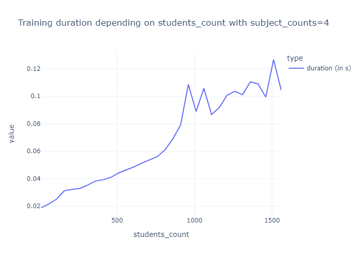
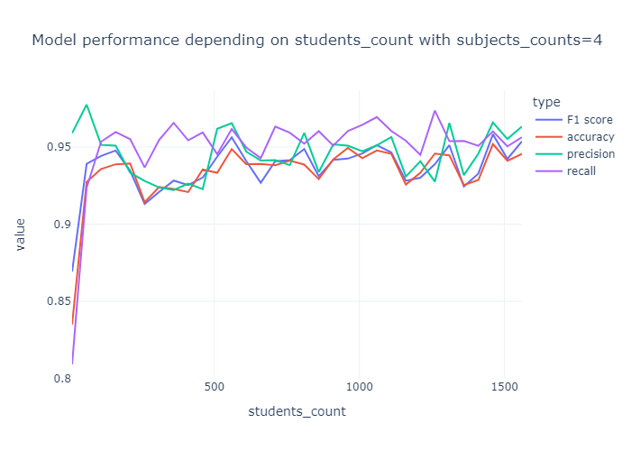
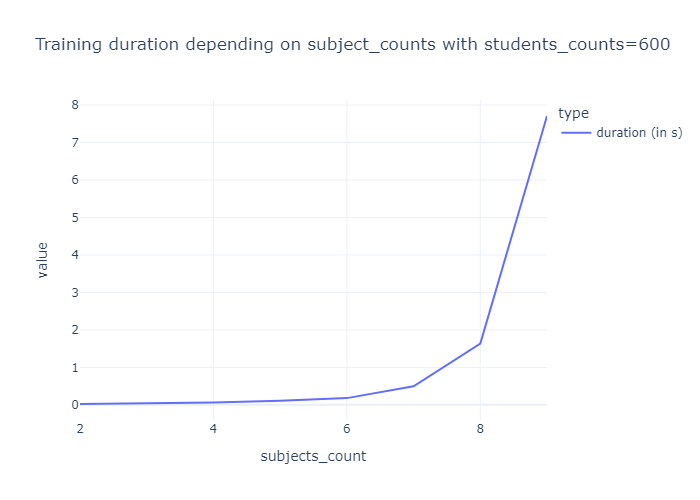
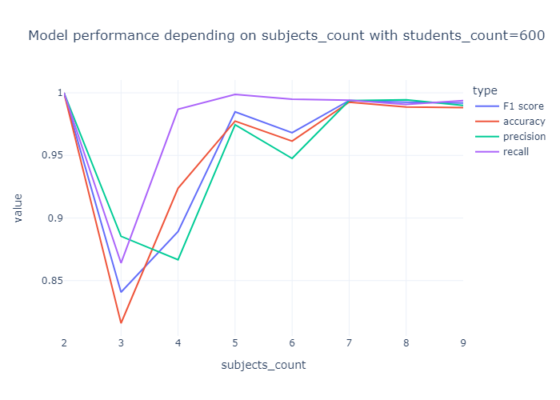
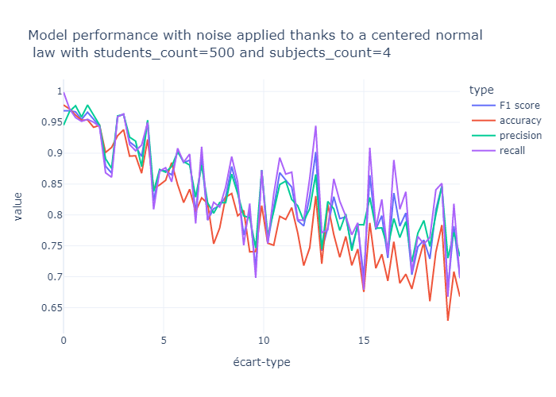
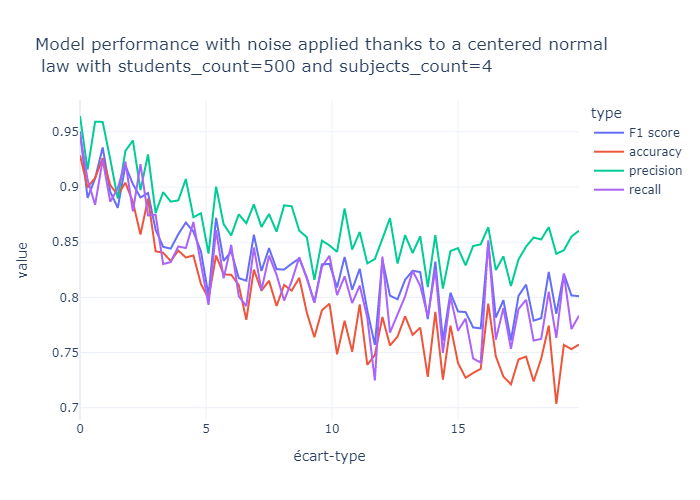
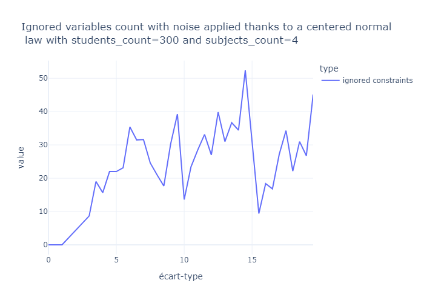
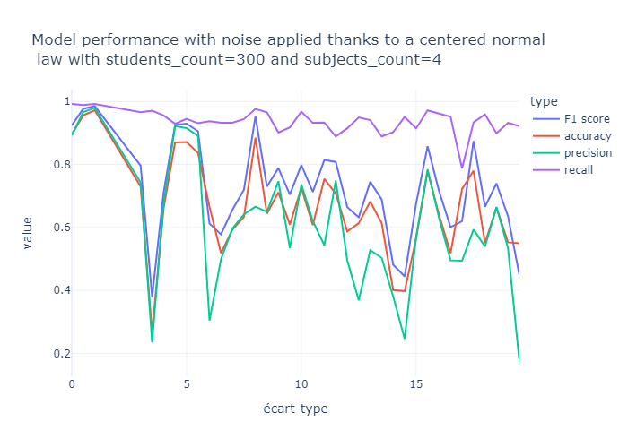

# Projet : student admission

**Groupe :** 

- FORESTIER Alexandre
- SENEJKO Morgane

# Sujet :

L'objectif du projet est de comparer trois solveurs d'optimisation sur le thème d'admissions d'étudiants.

Les jeux de données générés sont constitués de notes d'étudiants sur différentes matières. Selon ces notes, et à l'aide des coefficients pour chaque matière ainsi qu'un seuil d'admissibilité, les étudiants appartiennent à une certaine classe (par exemple: Admis ou Refusé dans le cas de deux classes).

Dans un premier temps, nous avons implémenté le modèle Inv-MR-Sort à l'aide d'un solveur d'optimisation (Gurobi). Puis nous avons implémenté un modèle Inv-NCS à l'aide du solveur Gophersat, avec une formulation SAT mais également avec une formulation MaxSAT.
Puis nous avons étudié les performances de ces modèles en comparant leurs temps de calcul, leur capacité de généralisation mais aussi leur capacité à prendre en compte des données bruitées.


# Structure du projet :

## Structure des fichiers

Ce répertoire GIT suit la structure suivante:

```dir
│   generate_dataset.py
│   maxsat_solver_evaluation.ipynb
│   part1_gurobi_2_classes.ipynb
│   part2_maxsat_k_classes.py
│   part2_sat_k_classes.py
│   README.md
│   sat_solver_evaluation.ipynb
└───gophersat
       gophersat-1.1.6.exe
```

**`./gophersat/gophersat-1.1.6.exe` is where the gophersat solver is located**

`generate_dataset.py` Contient des fonctions de génération et de manipulation des datasets.

`part1_gurobi_2_criteres.ipynb` Résolution et évaluation des performance d'un modèle MR-Sort. Vous pouvez exécuter le notebook entier, la dernière partie est assez longue car elle calcule les performances du modèle sur divers datasets.

`part2_sat_k_classes.py` Résolution du problème avec modèle NCS à l'aide d'une formulation SAT.

`sat_solver_evaluation.ipynb` Evaluation du modèle NCS avec formulation SAT.

`part2_maxsat_k_classes.py` Résolution du problème avec modèle NCS à l'aide d'une formulation MaxSAT.

`maxsat_solver_evaluation.ipynb` Evaluation du modèle NCS avec formulation MaxSAT.

`/graphs` Stockage statique des graphes.


## Modules utilisés

- gurobipy
- numpy
- plotly (Dataviz)
- kaleido (Export statique des graphes)
- sklearn (Calcul des matrices de confusion)
- numpy

# Résultats MR-Sort 

| Parameter      | Duration                                 | Performance                          |
|----------------|------------------------------------------|--------------------------------------|
| Students count |  |  |
| Subjects count |  |  |


# Résultats Inv-NCS

| Parameter      | Duration                              | Performance                       |
|----------------|---------------------------------------|-----------------------------------|
| Students count |  |  |
| Subjects count |  |  |

# Sensibilité au bruit des modèles Inv-NCS et MR-SORT

| Solveur MR-Sort                   | Solveur SAT                       |
|-----------------------------------|-----------------------------------|
|  |     |


# Modèle Inv-NCS avec formulation MaxSat

| Nombre de variables ignorée          | Performance                       |
|--------------------------------------|-----------------------------------|
|  |  |
